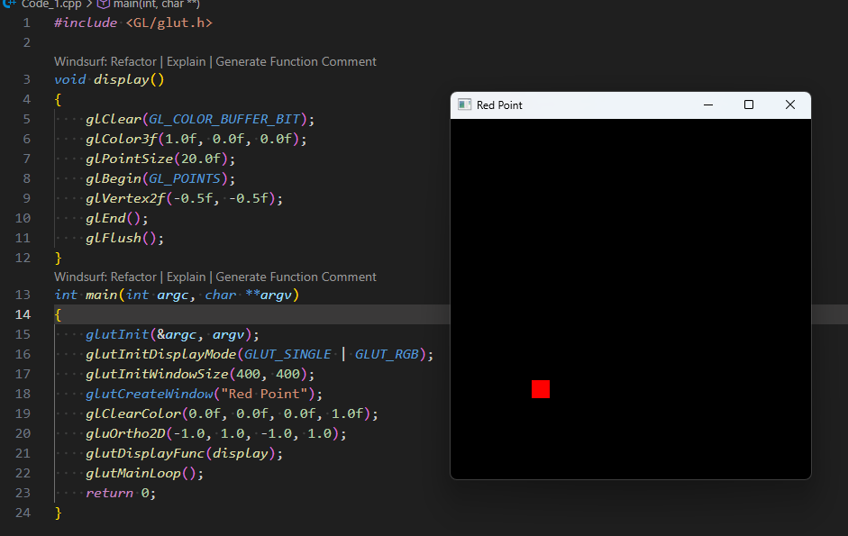

# 🎨 OpenGL Basic Point Rendering

مشروع بسيط لتعلم أساسيات الرسم باستخدام مكتبة **OpenGL** و **GLUT**. يقوم البرنامج برسم نقطة حمراء في منتصف الشاشة مع شرح مفصل لكل دالة مستخدمة.

---

## 🚀 ملخص الكود (Code Breakdown)

### 1. إعدادات الألوان والنقاط
داخل دالة `display()`، بنتحكم في شكل ولون العنصر:

* **`glColor3f(R, G, B)`**: تحديد اللون. القيم تتراوح من `0.0` إلى `1.0`.
    * مثال: `(1.0, 0.0, 0.0)` يعطي لوناً **أحمر**.
* **`glPointSize(size)`**: تحديد حجم النقطة بالبكسل.

### 2. أنواع الرسم (Drawing Primitives)
بين الدالتين `glBegin()` و `glEnd()` بنحدد نوع الشكل:

| الأمر | الوظيفة |
| :--- | :--- |
| `GL_POINTS` | رسم كل نقطة منفصلة. |
| `GL_LINES` | توصيل كل نقطتين بخط. |
| `GL_TRIANGLES` | رسم مثلث لكل 3 نقاط. |
| `GL_QUADS` | رسم شكل رباعي لكل 4 نقاط. |
| `GL_POLYGON` | رسم مضلع مغلق مهما كان عدد النقاط. |

### 3. إحداثيات النقطة
* **`glVertex2f(x, y)`**: تحديد مكان النقطة في مساحة ثنائية الأبعاد.
    * في هذا المثال استخدمنا الإحداثيات `(-0.5, -0.5)`.

---

## 🛠️ كيف يعمل البرنامج؟ (Internal Logic)

> **ملاحظة عن `glFlush()`:**
> المعالج الرسومي (GPU) يجمع الأوامر في مخزن مؤقت (Buffer) ولا ينفذها فوراً لتوفير الجهد. دالة `glFlush()` تجبره على تنفيذ كل الأوامر المعلقة وعرضها على الشاشة فوراً.

### دالة `main` والإعدادات:
1.  **`glutInit`**: تهيئة مكتبة GLUT وتمرير معاملات الـ Terminal.
2.  **`glutInitDisplayMode`**: تحديد نظام الألوان (RGB) ونوع التخزين (Single Buffer).
3.  **`gluOrtho2D`**: تحديد حدود الرؤية (Coordinates System)، هنا من `-1.0` إلى `1.0` على المحورين $x$ و $y$.

---

## 💻 متطلبات التشغيل (Prerequisites)

تحتاج إلى تثبيت مكتبة OpenGL و GLUT على جهازك:
* **Windows**: FreeGLUT or Nuget packages in VS.
* **Linux**: `sudo apt-get install freeglut3-dev`
* **Mac**: Built-in OpenGL framework.

---

## 📝 ملاحظات إضافية
تم كتابة هذا الكود التعليمي لتبسيط مفاهيم:
* التعامل مع الـ Viewport.
* فهم الـ Coordinate System في OpenGL.
* التحكم في الـ Rendering Pipeline البسيط.
